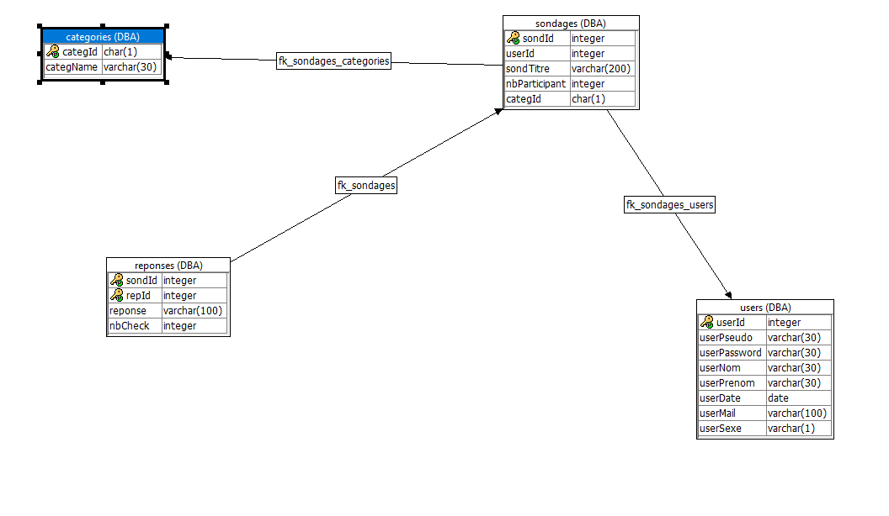

# Présentation de l'équipe
Maxime Lits 
Matthew Everard 
Charlier François

Groupe : M2PR05_sondage

# Description du projet
Le projet utilise une page Html reliée à une base de données qui permet de créer et d'enregistrer des sondages faisant partie de différentes catégories ainsi que leurs réponses. 
Le but est que les utilisateurs peuvent exprimer leurs avis sur chaque sondage créé.
L’utilisateur inscrit possède un profil qui peut être vu par les autres utilisateurs afin d'afficher ses informations personnelles ainsi que les sondages qu'il a créé.
Il est aussi possible de se connecter anonymement afin de répondre aux sondages sans devoir se connecter.
En revanche, un utilisateur anonyme ne peut pas créer de sondage.

# Aspects implémentés
* La partie backend sert à stocker les utilisateurs, les sondages, les réponses des sondages et les catégories.

* La partie frontend sert à gérer la partie client et de faire le lien avec la partie backend via les webservices.

# Détail api rest
* Webservice root :
  - Fait appel à la procédure get_page qui permet d'ouvrir notre fichier html.
  - Comporte un seul paramètre de type char qui représente le nom de notre fichier Html.
  - Type raw.
  - Auteur : commun
  
* Webservice js :
  - Fait appel à la procédure get_page qui permet de lier notre js à notre html.
  - Comporte un seul paramètre de type char qui représente le nom de notre fichier Js.
  - Type raw.
  - Auteur : commun
  
* Webservice css :
  - Fait appel à la procédure get_page qui permet de lier notre css à notre html.
  - Comporte un seul paramètre de type char qui représente le nom de notre fichier Css.
  - Type raw.
  - Auteur : commun
  
* Webservice imgs :
  - Fait appel à la procédure get_page qui permet de lier notre js à notre html.
  - Comporte un seul paramètre de type char qui représente le nom de notre fichier Js.
  - Type raw.
  - Auteur : commun
  
* Webservice get_sondage  :
  - Fait appel à la procédure get_sondage qui permet de récupérer dans la base de données le titre du sondage, les réponses et               leurs nombres de votes, le nombre de participant ainsi que l'id du créateur en les tranformant en un objet JSON.
  - Comporte un seul paramètre de type integer qui représente l'ID du sondage que l'on souhaite récupérer.
  - Type JSON
  - Auteur : commun
  
* Webservice get_sondages :
  - Fait appel à la procédure get_sondagesOfCateg qui permet de récupérer dans la base de données les titres des sondages ainsi             que l'id des sondages en les tranformant en un objet JSON.
  - Comporte un seul paramètre de type char qui représente l'ID de la catégories des sondages que l'on souhaite récupérer.
  - Type JSON
  - Auteur : Matthew Everard
  
* Webservice get_sondagesOfUser :
  - Fait appel à la procédure get_sondagesOfUser qui permet de récupérer dans la base de données les titres des sondages ainsi que           l'id des sondages en les tranformant en un objet JSON.
  - Comporte un seul paramètre de type integer qui représente l'ID du créateur des sondages que l'on souhaite récupérer.
  - Type JSON
  - Auteur : François Charlier

* Webservice get_usersTable :
  - Fait appel à la procédure get_usersTable qui permet de récupérer dans la base de données les Ids, les noms, les prénoms, les             mot de passe, les pseudos, les mails, les dates de naissance ainsi que le sexe de tout les utilisateurs en les tranformant en     un     objet JSON.
  - Comporte un seul paramètre de type integer qui permet de sécuriser les informations des utilisateurs.
  - Type JSON
  - Auteur : MAtthew Everard
  
* Webservice get_createUser :
  - Fait appel à la procédure get_createUser qui permet d'ajouter dans la base de données le nom, le prénom, le mail, le mote de       passe, la date de naissance , le pseudo ainsi que le sexe d'un nouvel utilisateur.
  - Comporte 7 paramètres qui sont le pseudo, le mot de passe, le nom, du prénom, et le mail qui sont de type varchar, la date       de naissance qui est de type date et le sexe qui est de type char.
  - Type raw
  - Auteur : Maxime Lits
  
* Webservice get_createSondage :
  - Fait appel à la procédure get_createSondage qui permet d'ajouter dans la base de données l'ID du créateur, la question, l'ID       de la catégorie ainsi que les deux à six réponses du nouveau sondage.
  - Comporte 9 paramètres qui sont l'Id du créateur qui est de type integer, l'Id de la catégorie qui est de type char et la         question ainsi que les réponses qui sont de type varchar.
  - Type raw
  - Auteur : François Charlier
  
* Webservice get_addCheck :
  - Fait appel à la procédure get_addCheck qui permet de modifier dans la base de données le nombre de participants à un sondage             ainsi que le nombre de votes pour chaque réponse du sondage.
  - Comporte deux paramètres qui sont l'Id du sondage et l'Id de la réponse qui sont de type integer.
  - Type raw
  - Auteur : Maxime Lits

* Fonction get_path :
  - Permet de récuperer le chemin des fichiers utilisés pour notre projet.
  - Ne comporte aucun paramètre.
  - Elle renvoit une valeur de type long varchar.
  - Auteur : Commun

* Fonction get_sondId :
  - Permet de récupérer l'Id du dernier sondage créé.
  - Ne comporte aucun paramètre.
  - Elle renvoit une valeur de type integer.
  - Auteur : Commun

# Détail DB
Notre base de données se compose de 4 tables qui sont respectivement :
* users :
   - Cette table comporte 8 colonnes :
     1. userId : cette colonne est un autoincrement qui crée automatiquement les Ids des utilisateurs ( type Integer ).
     2. userPseudo : cette colonne permet de stocker le pseudo de tous les utilisateurs ( type varchar ).
     3. userPassword : cette colonne permet de stocker le mot de passe de tous les utilisateurs ( type varchar ).
     4. userNom : cette colonne permet de stocker le nom de tous les utilisateurs ( type varchar ).
     5. userPrenom : cette colonne permet de stocker le prénom de tous les utilisateurs ( type varchar ).
     6. userDate : cette colonne permet de stocker la date de naissance de tous les utilisateurs ( type date ).
     7. userMail : cette colonne permet de stocker l'adresse email de tous les utilisateurs ( type varchar ).
     8. userSexe : cette colonne permet de stocker le genre de tous les utilisateurs ( type char ).
   - La clé primaire pk_users est la colonne userId.
   
* sondages :
   - Cette table comporte 5 colonnes : 
     1. sondId : cette colonne est un autoincrement qui crée automatiquement les Ids des sondages ( type Integer ).
     2. userId : cette colonne permet de stocker l'Id du créateur des sondages  ( type Integer ).
     3. sondTitre : cette colonne permet de stocker le titre des sondages ( type varchar ).
     4. nbParticipant : cette colonne permet de stocker le nombre de participants aux sondages ( type Integer ).
     5. categId : cette colonne permet de stocker l'Id de la catégorie des sondages ( type char ).
   - La clé primaire pk_sondages est la colonne sondId.
   - Les clés étrangères sont fk_sondages_users et fk_sondages_categories, celles permettend de faire les liens avec les tables        catégories et users
   
* reponses :
   - Cette table comporte 4 colonnes :
     1. sondId : cette colonne permet de stocker l'Id des sondages  ( type Integer ).
     2. repId : cette colonne est un autoincrement qui crée automatiquement les Ids des réponses ( type Integer ).
     3. reponse : cette colonne permet de stocker les deux à six réponses des sondages ( type varchar ).
     4. nbCheck : cette colonne permet de stocker le nombre de votes pour chaque réponses ( type Integer ).
   - La clé primaire pk_reponses est le jumelage entre la colonne sondId et repId.
   - La clé étrangère est fk_reponses_sondages, elle permet de faire un lien avec la table sondages.

* categories : 
   - Cette comporte 2 colonnes :
     1. categId : cette colonne permet de stocker l'Id de la catégorie des sondages ( type char ).
     2. categName : cette colonne permet de stocker le nom de chaque catégorie ( type varchar ).
   - La clé primaire pk_categories est la colonne categId.

